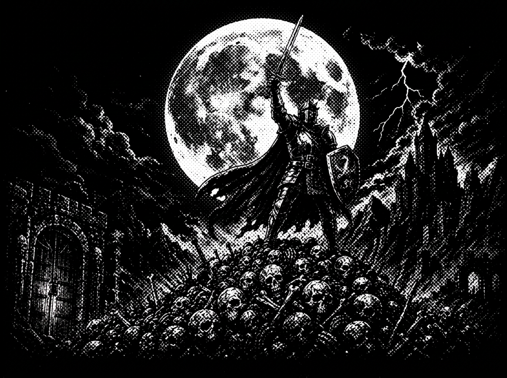

# Dungeon Days

A retro CRT roguelike that runs entirely in the browser. Clear each chamber, descend the stairs, and see how many days you can survive the dungeon.

> *They say the knight who clears the Lower Halls will have his name carved into the gates of the capital. But no one dares ask what happened to the last knight who believed that.*



## Play

It's a single self-contained HTML file — no build step, no dependencies.

- **Locally:** open `index.html` in a modern browser. Because the game loads sprite and audio files, it's best served over HTTP rather than `file://`:
  ```bash
  python3 -m http.server 8000
  # then visit http://localhost:8000
  ```
- **Deploy:** drop the whole folder on any static host (GitHub Pages, Netlify, itch.io, etc.).

## How to play

- **WASD / Arrow keys** — Move
- **Space** — Shoot in the last direction you faced
- **Eliminate all enemies** in a chamber to reveal the stairs
- **Walk into the stairs** to descend to the next day

Each day is a freshly generated dungeon. Survive as many days as you can.

### Extra keys

| Key | Action |
|-----|--------|
| `P` | Toggle the CRT / post-processing shader |
| `M` | Toggle the minimap |
| ⚙ (top-right) | Pause & open settings (music / SFX volume) |

## Features

- **Procedural dungeons** — every level is built with BSP room generation, so no two days are alike.
- **Powers** — spend tokens (dropped by enemies and found in rooms) on upgrades between days: extra projectiles, piercing rounds, shields, lifesteal, a one-time revive, faster movement, and more.
- **Curse ladder** — difficulty creeps up daily. Every 5th day draws a temporary curse (SWARM, FRENZY, BONELORD); every 10th day the last curse becomes permanent and stacks.
- **Shrines** every 3rd day let you choose a blessing (+max HP) or empower a power you already own.
- **Relics** unlock new powers into the upgrade pool.
- **Retro presentation** — a WebGL CRT shader (chromatic aberration, bloom, scanlines, dithering, a dithered player-light falloff) with a raw-canvas fallback, plus a tiny built-in WebAudio 8-bit sound synth. Volume preferences persist in `localStorage`.

## Project structure

```
index.html   — the entire game (HTML, CSS, canvas rendering, WebGL shader, game logic)
sprites/     — player, enemy, wall, floor, gate, and health SVG/PNG art
Music/       — background music track (looped)
KeyArt/      — promotional key art (also used for social sharing / Open Graph)
```

## Tech

Vanilla JavaScript with a 2D canvas game buffer blitted through a WebGL fragment shader for the CRT look. No frameworks, no bundler. Fonts (*Jacquard 12*, *Tiny5*) are loaded from Google Fonts.

## Support

If you enjoy it, you can [leave a tip on Ko-fi](https://ko-fi.com/freshcake). ♥
